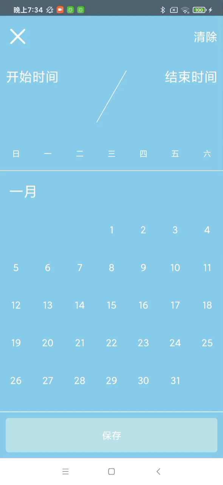

# 日历 弹窗组件


## Props
```javascript
CalendarModal.propTypes = {
  visible: PropTypes.bool, // 弹窗显示隐藏
  onChangeVisible: PropTypes.func, // 弹窗显示隐藏事件
  onClose: PropTypes.func, // 弹窗关闭事件
  onClear: PropTypes.func, // 清除事件
  onSelect: PropTypes.func, // 日期选择事件
  onSave: PropTypes.func, // 保存事件
  lang: PropTypes.string, // 语言，zh OR en
  minDate: PropTypes.string, // 日历最小日期
  maxDate: PropTypes.string, // 日历最大日期
  startDate: PropTypes.string, // 选中的开始时间
  endDate: PropTypes.string, // 选中的结束时间
  format: PropTypes.string, // 时间显示格式
};

CalendarModal.defaultProps = {
  visible: false,
  onChangeVisible: visible => {},
  onClose: () => {},
  onClear: () => {},
  onSelect: (start, end) => {},
  onSave: (start, end) => {},
  lang: 'zh',
  minDate: defaultMinDate,
  maxDate: defaultMaxDate,
  startDate: null,
  endDate: null,
  format: 'YYYY年MM月DD日',
};
```

## Use
```javascript
<CalendarModal
  visible={this.state.modalVisible}
  onChangeVisible={(visible) => {
    this.setState({
      modalVisible: visible,
    })
  }}
/>
```